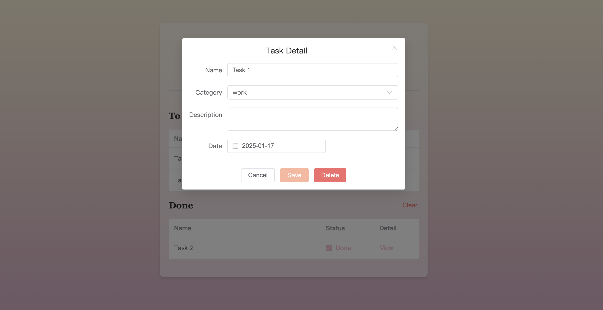

# ToDoList

## 技术栈

- 主要使用  Vue 3 + Vite + Typescript
- 组件库使用了 Element Plus，渐变配色借助了 webgradients

## 介绍

一个可以在本地上运行的备忘录，能够实现添加与编辑todo条目等基本功能。

- 使用 competed 计算属性监听，实现对已完成和未完成的todo条目的响应式分类。
- 利用 props 进行父子组件通信，传递todo条目的数据。
- 在实现添加与编辑todo条目功能时，结合了 Element Plus 组件库的 Dialogue 对话框与 Form 表单组件，用到`input`、`select`、`checkbox`、`date picker`等表单项，并完成表单校验与提交后重置表单等逻辑。
- 优化了 UI 组件的样式。

## 界面

运行后，备忘录页面如图，分为 To Do 和 Done 两部分。

勾选 Undone，当前todo条目将被移入 Done 区域。点击 clear，Done 区域中所有的内容会被删除。

点击标题下的 Add Task 按钮，会弹出对话框，填入必填信息后选中 Add，新的todo条目就会在页面显示。

点击 View，可以查看当前条目的具体信息，并进行修改和删除操作。

